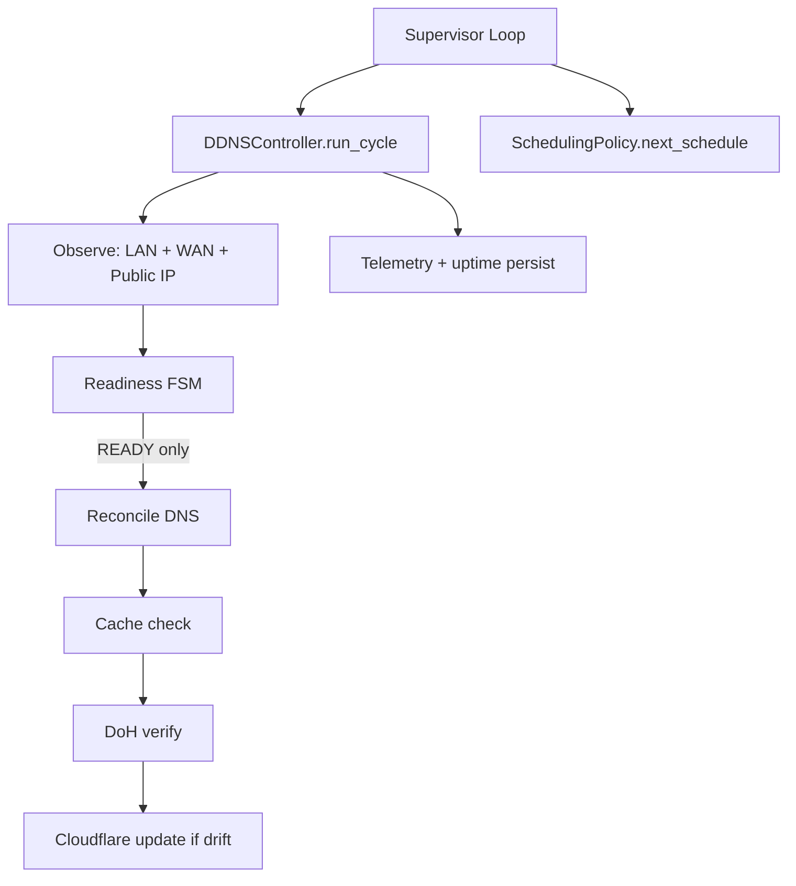

# cloudflare-verified-ddns 🚀  
**The reliable Cloudflare DDNS client that actually verifies before it updates**

[](https://www.python.org/downloads/)
[](https://github.com/bkaewell/cloudflare-verified-ddns/actions/workflows/docker-publish.yaml)
[](https://ghcr.io/bkaewell/cloudflare-verified-ddns)


**Why this exists - and why better matters**  
Residential ISPs change your IP frequently. CGNAT blocks inbound connections. Paths drop for seconds or minutes. Cloudflare [rate-limits](https://developers.cloudflare.com/fundamentals/api/reference/limits/) reckless API callers.

Most DDNS tools ignore all of that. They poll too often, update without checking if the change actually landed, flap records during brief outages, and leave you guessing when something goes wrong.

That stops here.  

I built this informed by real systems engineering experience: missile defense (intercepting threats with zero margin for error) and autonomous driving (real-time decisions at highway speed under uncertainty).

The same rules apply:  
- Never act unless the situation is confirmed safe  
- Verify every critical outcome  
- Conserve resources when stable, respond decisively when not  
- Record everything so you can understand what happened  

Result: **the only open-source Cloudflare DDNS that gates updates on actual readiness, verifies propagation via DoH, and stays quiet when everything is working**.

Key behaviors:
- **Readiness-gated updates** — only writes to Cloudflare when WAN is healthy and reachable  
- **DNS-verified reconciliation** — confirms the new record is live via DoH before considering the job done  
- **Cache-first + monotonic loop** — skips unnecessary API calls when local state is fresh and trusted  
- **Adaptive polling** — fast recovery during problems, long intervals (minutes+) when stable → saves API quota and CPU resources 
- **Operator-grade telemetry** — detailed, timestamped logs + persistent uptime stats that survive restarts  
- **Hardened & container-native** — minimal docker image footprint, secure defaults, easy to run anywhere

This is not another quick script.  
It is production-grade control logic moved to the home edge — and it is open source so no one has to keep settling for fragile workarounds.

**What this actually gives you**  
- WireGuard / Tailscale / OpenVPN server stays reachable even when your IP changes three times today  
- Nextcloud, Home Assistant, Jellyfin, or any self-hosted service remains accessible without relying on heavier Cloudflare Tunnel setups  
- Multi-WAN or failover becomes sane instead of chaotic  
- Remote access stays secure and hidden behind Cloudflare proxy — no naked public IP

You no longer choose between "works most of the time" and "requires constant babysitting."  
You get the third option: it just works, quietly and correctly.

**Quick start — Docker**
The fastest path to stop worrying about DDNS.

```bash
docker run -d \
  --name cloudflare-verified-ddns \
  --restart unless-stopped \
  -v cloudflare-verified-ddns-cache:/app/cache \
  -e CLOUDFLARE_API_TOKEN=your_token_here \
  -e CLOUDFLARE_ZONE_ID=your_zone_id \
  -e CLOUDFLARE_DNS_NAME=vpn.yourdomain.com \
  -e CLOUDFLARE_DNS_RECORD_ID=optional_record_id_if_you_have_it \
  ghcr.io/bkaewell/cloudflare-verified-ddns:latest
```

Watch the logs to see it think:

```bash
docker logs -f cloudflare-verified-ddns
```

Typical output when healthy:

```console
23:02:39 🔁 LOOP        START      Tue Mar 03 2026    | loop=1
23:02:39 🟢 ROUTER      UP         ip=192.168.0.1     | rtt=11ms
23:02:39 🟢 WAN_PATH    UP         dest=1.1.1.1:443   | rtt=69ms | tls=ok
23:02:39 🟢 PUBLIC_IP   OK         ip=x.x.x.x         | rtt=92ms
23:02:39 💚 VERDICT     READY      —————————                  
23:02:39 🟢 CACHE       HIT        age=743s           | rtt=2.1ms
23:02:39 🌐 DDNS        NO-OP      cache=hit                     
23:02:39 🔁 LOOP        COMPLETE   —————————          | loop=181ms | uptime=99.15% (8597/8671)
23:02:39 🐾 SCHEDULER   CADENCE    SLOW_POLL          | sleep=123s | jitter=3s
```

**Other ways to run it**
  - Docker Compose → full example in [`docs/DEPLOYMENT.md`](./docs/DEPLOYMENT.md)  
  - Local development → `uv sync --dev && uv run --env-file .env -m app.main`  
  - All configuration options → `docs/CONFIGURATION.md` (./docs/CONFIGURATION.md)

**Architecture overview**



Core files: 
  - `main.py` (supervisor)
  - `ddns_controller.py` (brain)
  - `readiness.py` (gatekeeper)
  - `scheduling_policy.py` (cadence)
  - `cache.py` (memory)

**📚 Documentation**  
  - Getting Started (./docs/GETTING_STARTED.md)  
  - Configuration Deep Dive (./docs/CONFIGURATION.md)  
  - Deployment Examples (./docs/DEPLOYMENT.md)  
  - Troubleshooting (./docs/TROUBLESHOOTING.md)  
  - Architecture (./docs/ARCHITECTURE.md)

Video walkthroughs coming soon — real demos, not slides.

**Contributing**
I welcome thoughtful contributions. Read `CONTRIBUTING.md` (./CONTRIBUTING.md), open an issue or pull request. High-quality PRs get merged quickly.

**Topics for discoverability**  
`cloudflare`, `ddns`, `dynamic-dns`, `homelab`, `self-hosted`, `network-reliability`, `wireguard`, `cgnat`, `dns-automation`, `vpn`, `cloudflare-api`, `dns-over-https`, `api-rate-limiting`, `caching`, `docker`, `docker-image`, `lightweight`, `container-optimization`

**One-liner repo description**  
Reliable Cloudflare DDNS: readiness-gated updates, DoH verification, adaptive polling, and clear telemetry for dynamic residential IPs.

**Social preview suggestion**  
  -**Bold title**: cloudflare-verified-ddns  
  -**Tagline**: "It only updates when it's ready. It stays silent when it's healthy."  
  -**Visual**: Cloudflare logo + clean status line (🟢 READY / 🐾 SLOW_POLL) + subtle DNS record icon

**The bigger picture**  
Bad DDNS scripts have been the weak link in homelabs for years.  
This project exists to end that era.  

If it saves you time, frustration, or an outage — star it, fork it, open an issue, send a PR.  
If it solves a real problem for you, star it, share it, improve it.
Every improvement here raises the bar for thousands of other self-hosters.

The choice is clear: keep fighting brittle scripts, or switch to the one that was built right.

Choose better.
