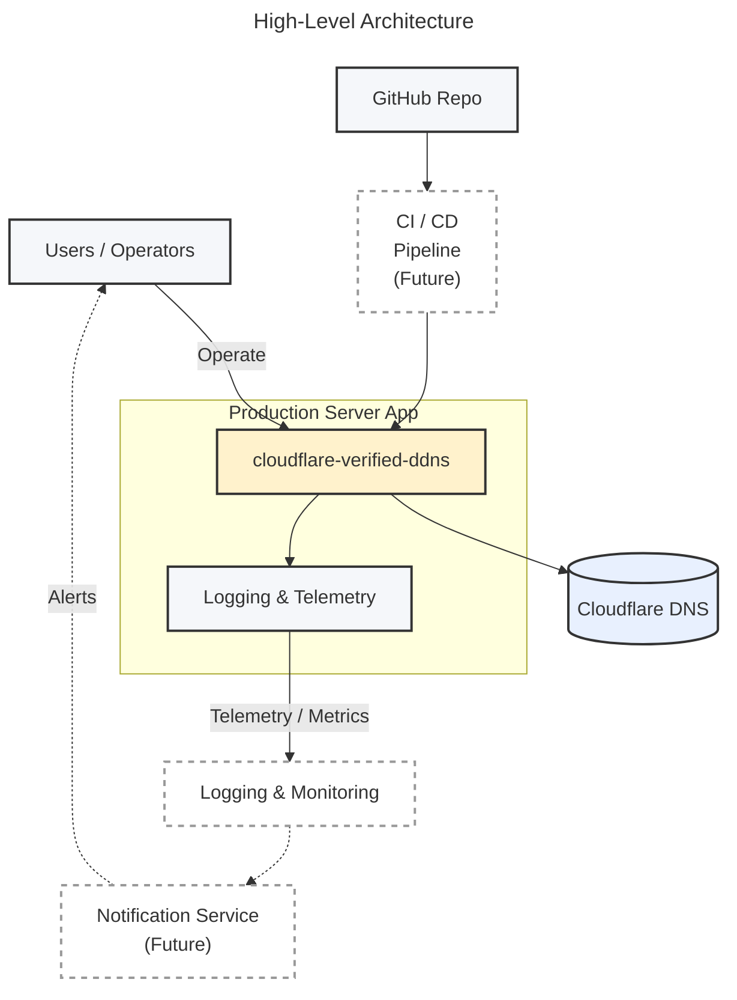
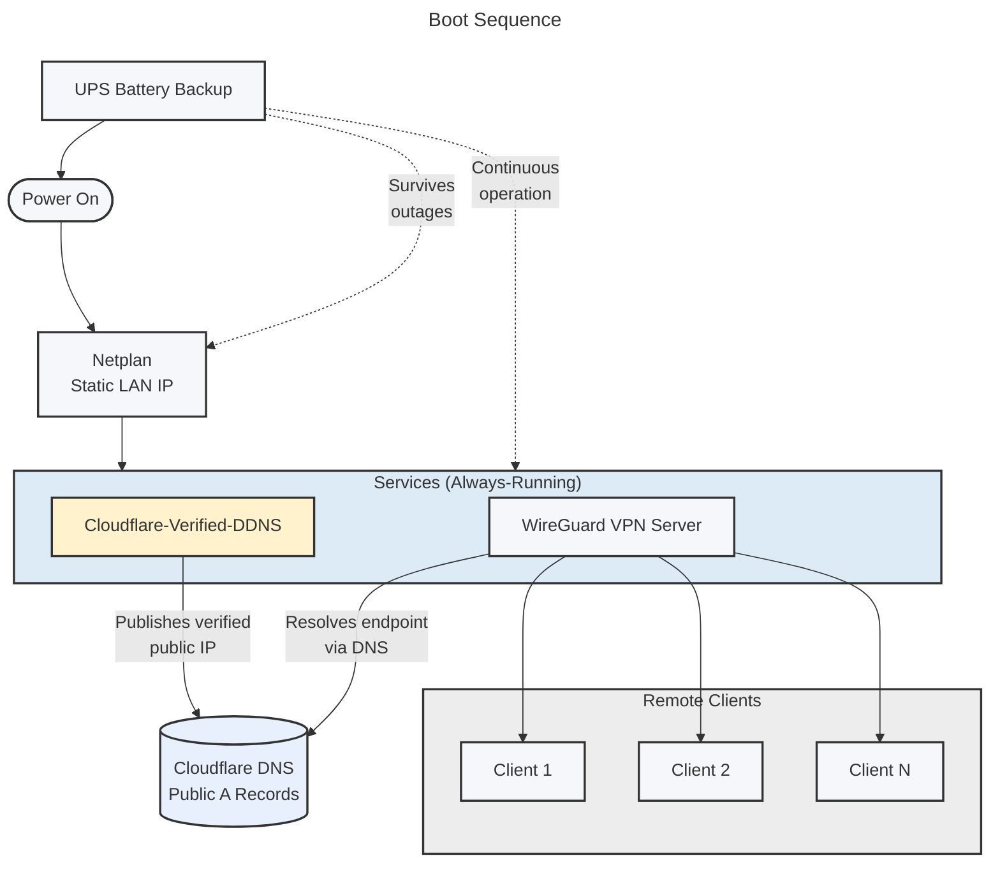

# Architecture

## Overview

TBD

## High-Level Architecture

```mermaid
---
title: High-Level Architecture
config:
   look: classic
   theme: 'default'
---
flowchart TB
    %% Users & Repo
    USERS[Users / Operators]
    REPO[GitHub Repo]
    CICD["CI / CD<br/>Pipeline<br/>(Future)"]

    %% Host + Deployed Software
    subgraph APPBOX["Production Server App"]
        direction TB
        DDNS[cloudflare-verified-ddns]
        TLOG[Logging & Telemetry]
    end

    %% External Systems
    CF[(Cloudflare DNS)]
    LOGS[Logging & Monitoring]
    NOTIFY["Notification Service<br/>(Future)"]

    %% Core Flow
    USERS -->|Operate| DDNS

    REPO --> CICD
    CICD --> DDNS
    DDNS --> CF

    %% Observability & Feedback
    DDNS --> TLOG
    TLOG -->|Telemetry / Metrics| LOGS
    LOGS -.-> NOTIFY
    NOTIFY -.->|Alerts| USERS    


    %% Styling
    classDef core fill:#fff2cc,stroke:#333,stroke-width:2px;
    classDef neutral fill:#f5f7fa,stroke:#333,stroke-width:2px;
    classDef cloud fill:#e8f0fe,stroke:#333,stroke-width:2px;
    classDef future fill:#ffffff,stroke:#999,stroke-width:2px,stroke-dasharray: 5 5;

    class DDNS core;
    class TLOG neutral;
    class REPO,USERS neutral;
    class CF cloud;
    class CICD,LOGS,NOTIFY future;
```

---

## Boot Sequence

```mermaid
---
title: Boot Sequence
config:
   look: classic
   theme: 'default'
---
flowchart TB
    %% Power & Init (Context)
    UPS[UPS Battery Backup]
    BOOT([Power On])
    NET[Netplan<br/>Static LAN IP]

    %% Cloudflare (External System of Record)
    CF[(Cloudflare DNS<br/>Public A Records)]

    %% Services
    subgraph SERVICES["Services (Always-Running)"]
        DDNS[Cloudflare-Verified-DDNS]
        WG[WireGuard VPN Server]
    end

    %% VPN Clients
    subgraph CLIENTS["Remote Clients"]
        C1[Client 1]
        C2[Client 2]
        CN[Client N]
    end

    %% Power & Boot Context
    UPS --> BOOT
    UPS -. "Survives<br/>outages" .-> NET
    UPS -. "Continuous<br/>operation" .-> SERVICES

    BOOT --> NET
    NET --> SERVICES

    %% DNS as Shared Contract
    DDNS -->|Publishes verified<br/>public IP| CF
    WG -->|Resolves endpoint<br/> via DNS| CF

    %% VPN Usage
    WG --> C1
    WG --> C2
    WG --> CN

    %% Repo Link
    click DDNS "https://github.com/bkaewell/cloudflare-verified-ddns" "Open Cloudflare-Verified-DDNS Repo"
    click WG "https://github.com/bkaewell/wireguard-setup" "Open WireGuard VPN Server Repo"

    %% Styling
    classDef neutral fill:#f5f7fa,stroke:#333,stroke-width:2px;
    classDef focus fill:#fff2cc,stroke:#333,stroke-width:2px;
    classDef cloud fill:#e8f0fe,stroke:#333,stroke-width:2px;

    class UPS,BOOT,NET,WG,C1,C2,CN neutral;
    class DDNS focus;
    class CF cloud;
    style SERVICES fill:#ddebf7,stroke:#333,stroke-width:2px;
    style CLIENTS fill:#ededed,stroke:#333,stroke-width:2px;
```
  
