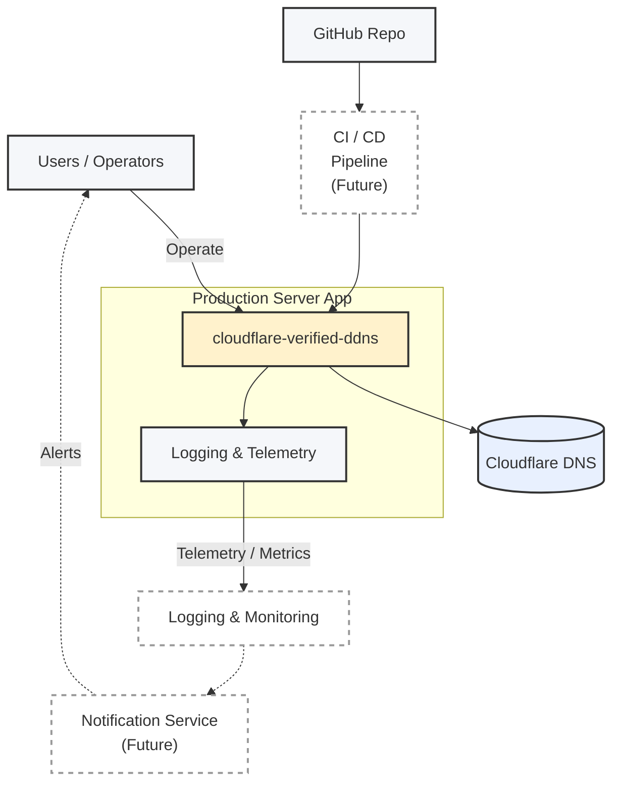

# Architecture

## High-Level Architecture

```mermaid
stateDiagram-v2
    direction LR

    INIT: ⚪ INIT<br/>No assumptions
    PROBING: 🟡 PROBING<br/>Observational only
    READY: 💚 READY<br/>Safe to act
    NOT_READY: 🔴 NOT_READY<br/>Known failure

    [*] --> INIT

    INIT --> PROBING : WAN OK
    NOT_READY --> PROBING : WAN OK

    PROBING --> READY : Stable IP<br/>confirmed
    PROBING --> PROBING : IP flapping

    READY --> READY : WAN OK

    %% Global failure invariant
    state "Any State" as ANY
    ANY --> NOT_READY : WAN Failure
```

  

## Overview

This project implements a **self-healing network watchdog** that continuously verifies WAN health and ensures that a device’s **public IP address remains consistent with its Cloudflare DNS record**.

The system is designed for **24/7 unattended operation**, optimized for:
- Fast no-op behavior under healthy conditions
- High signal-to-noise telemetry
- Conservative, state-driven recovery actions
- Clear separation of observation, decision-making, and mutation

It is intentionally **policy-driven**, **idempotent**, and **failure-aware**.

---

## Core Responsibilities

The watchdog performs one evaluation loop per cycle. Each execution cycle follows a strict **observe → assess → act** model:

1. **Observe**
   - Router reachability (LAN)
   - WAN path reachability
   - Public IP resolution

2. **Assess**
   - Build confidence in WAN stability across cycles
   - Classify WAN health (UP / DEGRADED / DOWN)
   - Track sustained failure streaks via a finite state machine (FSM)
   - Derive a single `NetworkState`

3. **Act**
   - Reconcile DNS when WAN is stable and when IP drift is confirmed
   - Escalate recovery only on sustained failure
   - Reset failure state on successful recovery
   - Emit structured telemetry

---

## High-Level Architecture (ASCII)

┌────────────────────┐
│  main_loop()       │
│  (Supervisor)      │
└─────────┬──────────┘
          │
          ▼
┌────────────────────┐
│ NetworkWatchdog    │
│ evaluate_cycle()   │
└─────────┬──────────┘
          │
 ┌────────┼─────────┐
 │        │         │
 ▼        ▼         ▼
LAN     WAN      Public IP
Probe   Probe    Resolution
 │        │         │
 └────────┼─────────┘
          ▼
 WAN Health Classifier
          │
          ▼
    WanFSM (Policy)
          │
          ▼
 DNS Sync / Recovery

 ---

## State Model
### WAN Health (Internal)
| State      | Meaning                        |
| ---------- | ------------------------------ |
| `UP`       | Public IP stable across cycles |
| `DEGRADED` | Reachable but not yet trusted  |
| `DOWN`     | Unreachable or failing         |

### Network State (External)
| State      | Meaning                               |
| ---------- | ------------------------------------- |
| `HEALTHY`  | All systems nominal                   |
| `DEGRADED` | WAN reachable but unstable            |
| `DOWN`     | WAN unavailable or router unreachable |
| `ERROR`    | Internal failure                      |
| `UNKNOWN`  | Fallback                              |

---

## WAN Health State Diagram (ASCII)

            ┌─────────────┐
            │             │
            │    DOWN     │◄──────────────┐
            │             │               │
            └─────▲───────┘               │
                  │                       │
        sustained │ failures              │
                  │                       │
            ┌─────┴───────┐        probe failure
            │             │─────────────────────┐
            │  DEGRADED   │                     │
            │             │─────────────────────┘
            └─────▲───────┘
                  │
       stable IP  │
      confirmed   │
                  │
            ┌─────┴───────┐
            │             │
            │     UP      │
            │             │
            └─────────────┘

---

## WAN Health State Diagram (Mermaid)

stateDiagram-v2
    [*] --> DEGRADED
    DEGRADED --> UP : IP stable across cycles
    UP --> DEGRADED : instability detected
    DEGRADED --> DOWN : sustained failures
    DOWN --> DEGRADED : partial recovery

---

## Failure Escalation Policy
TBD

---

## DNS Reconciliation Strategy
TBD

---

