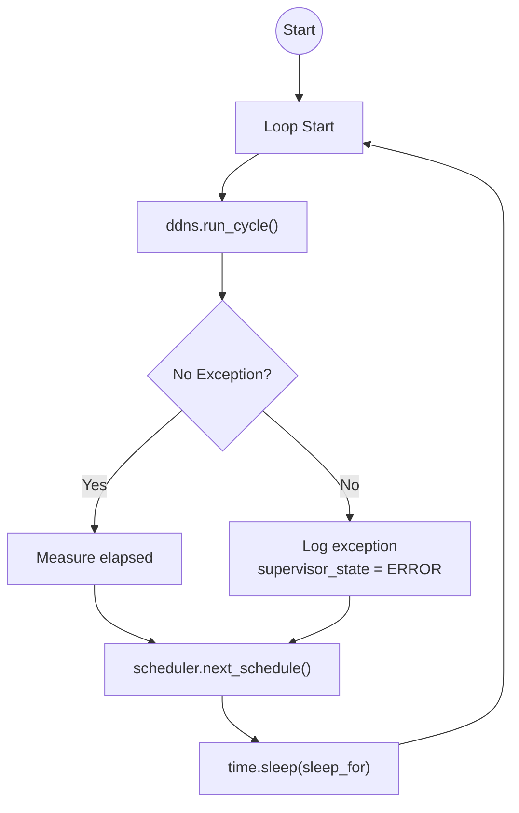
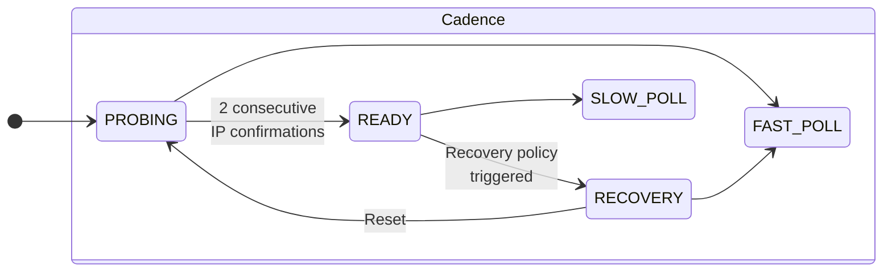

# Control Loop – Supervisor & Scheduling

## Overview

The top-level infinite loop (`run_supervisor_loop`) is the heartbeat of the agent.

**Responsibilities:**
- Run the DDNS cycle repeatedly
- Capture & log unhandled exceptions
- Delegate next-sleep decision to `SchedulingPolicy`
- Maintain adaptive polling cadence

**Key properties:**
- Never exits (lifecycle managed externally by Docker)
- Exceptions are contained and surfaced via telemetry
- Scheduling is adaptive to avoid API abuse and tight loops

## Supervisor Loop Flow

## Polling Cadence & Scheduler

- `FAST_POLL` (~30 s) during `PROBING` → quick convergence
- `SLOW_POLL` (~120 s) in steady state → reduce API load
- Jitter (0–10 s) prevents synchronized polling spikes if multiple instances run

### Why this design?
- No external cron/systemd timer → single-process simplicity
- Adaptive cadence balances freshness vs rate-limiting
- Exception containment prevents crash loops
- Jitter avoids thundering herd
- Fully observable via structured logs (cadence, sleep, jitter)
