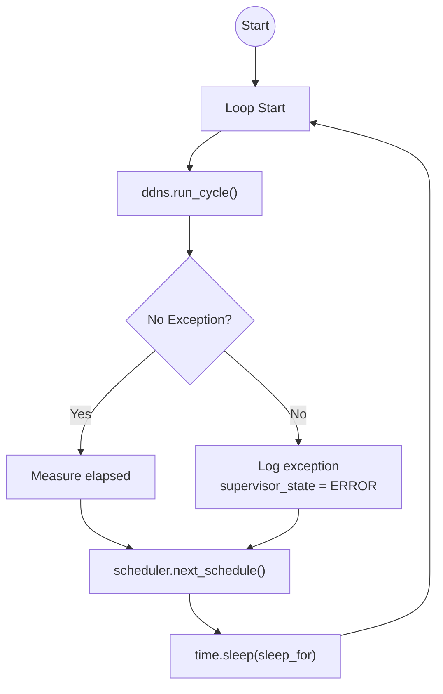
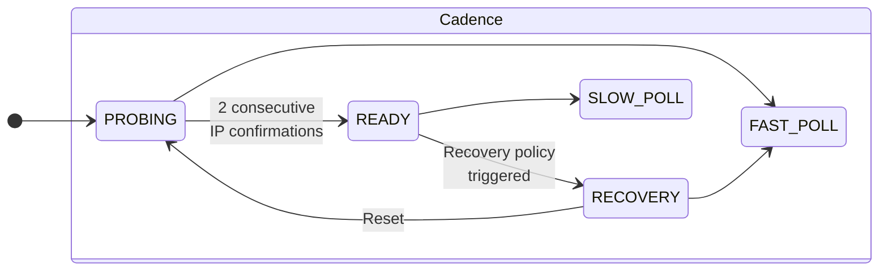

# Control Loop – Supervisor & Scheduling

## Overview

The top-level infinite loop (`run_supervisor_loop`) is the heartbeat of the agent.

**Responsibilities:**
- Run the DDNS cycle repeatedly
- Capture & log unhandled exceptions
- Delegate next-sleep decision to `SchedulingPolicy`
- Maintain adaptive polling cadence

**Key properties:**
- Never exits (lifecycle managed externally by Docker)
- Exceptions are contained and surfaced via telemetry
- Scheduling is adaptive to avoid API abuse and tight loops

## Supervisor Loop Flow


```mermaid
---
%%title: Main Supervisor Loop
config:
   look: classic
   theme: 'default'
---
graph TD
    Start([Init]) --> Loop{Supervisor<br>Loop ♾️}
    Loop --> Update[Reconcile DNS 🌐]
    Readiness[Readiness FSM 🚦] --> Poll
    %%<br/>⚪ INIT<br/>🟡 PROBING<br/>💚 READY<br/>🔴 NOT_READY"] --> Update
    Update --> Poll[Adaptive Polling Engine 🦧]
    Poll -->  |"Polling Speed"| Sleep[Sleep 💤]
    Sleep -->  Loop
    Readiness --> Update

    %% Visual highlights
    %%style Poll fill:#fff3e6,stroke:#cc6600,stroke-width:3px,rx:12,ry:12
    %%style Loop fill:#f0f8ff,stroke:#004080,stroke-width:3px,rx:12,ry:12
    %%style Update fill:#e6f3ff,stroke:#0066cc,stroke-width:2px
    %%style Start fill:#cce5ff,stroke:#004080,rx:12,ry:12
    %%style Sleep fill:#f8f9fa,stroke:#666,stroke-width:2px
    %%style Readiness 

    style Update,Poll,Loop,Start,Sleep,Readiness fill:#e6f3ff,stroke:#0066cc,stroke-width:2px

    %%linkStyle default stroke:#666,stroke-width:2px
```




## Polling Cadence & Scheduler



- `FAST_POLL` (~30 s) during `PROBING` → quick convergence
- `SLOW_POLL` (~120 s) in steady state → reduce API load
- Jitter (0–10 s) prevents synchronized polling spikes if multiple instances run

### Why this design?
- No external cron/systemd timer → single-process simplicity
- Adaptive cadence balances freshness vs rate-limiting
- Exception containment prevents crash loops
- Jitter avoids thundering herd
- Fully observable via structured logs (cadence, sleep, jitter)
