# Control Loop – Supervisor & Scheduling

## Overview

The top-level infinite loop (`run_supervisor_loop`) is the heartbeat of the agent.

**Responsibilities**
- Repeatedly execute the DDNS control cycle
- Capture and log unhandled exceptions without crashing
- Delegate next-poll timing to the adaptive scheduler
- Maintain steady, state-aware cadence for long-running operation

**Key Properties**
- Never exits — lifecycle managed externally by Docker (`restart: unless-stopped`)
- Exceptions are contained and surfaced via telemetry/logging
- Polling adapts automatically to system confidence (readiness state)

---

## Supervisor Loop Flow

### Main Supervisor Loop

*Infinite control loop that runs the DDNS cycle, handles exceptions, and adaptively schedules the next poll based on readiness state and elapsed time. Never exits — lifecycle managed by Docker's restart policy.*

```mermaid
---
title: Main Supervisor Loop
config:
   look: classic
   theme: 'default'
---
graph TD
    Start([Init]) --> Loop{Supervisor<br>Loop ♾️}
    Loop --> Update[Reconcile DNS 🌐]
    Readiness[Readiness FSM 🚦] --> |"Readiness"|Poll
    %%<br>⚪ INIT<br>🟡 PROBING<br>💚 READY<br>🔴 NOT_READY"] --> Update
    Update --> Poll[Adaptive Polling Engine 🦧]
    Poll -->  |"Polling Speed"| Sleep[Sleep 💤]
    Sleep -->  Loop
    Readiness --> |"Readiness"| Update

    %% Visual highlights
    classDef all fill:#e6f3ff,stroke:#0066cc,stroke-width:2px

    class Update,Poll,Loop,Start,Sleep,Readiness all
```

---

### Readiness FSM

*State machine that determines system trust level and directly drives polling speed. Fast poll during uncertainty/recovery; slow poll when stable.*

### Transitions & Meaning:
 - INIT → PROBING — Startup or WAN restored
 - PROBING → READY — 2 consecutive stable IP confirmations
 - PROBING → PROBING — IP flapping detected
 - Any → NOT_READY — WAN path failure (1.1.1.1:443 unreachable)
 - NOT_READY → PROBING — WAN path restored

---

### Adaptive Polling Engine (Scheduler)

*Readiness state directly controls polling speed: fast during uncertainty/recovery for rapid convergence, slow when stable to minimize load and API calls. Jitter prevents synchronized spikes.*

```mermaid
---
title: Adaptive Polling Engine (Scheduler)
config:
   look: classic
   theme: 'default'
---
graph LR
    subgraph "Readiness FSM"
        PROBING[🟡 PROBING<br>Observational /<br> Recovery]
        NOT_READY[🔴 NOT_READY<br>Known failure]
        READY[💚 READY<br> Steady state]
    end

    PROBING --> FAST_POLL["FAST Poll<br>~30 s + jitter"]
    NOT_READY --> FAST_POLL

    READY --> SLOW_POLL["SLOW Poll<br>~120 s + jitter"]

    %% Styling to emphasize impact
    classDef fast fill:#fff0e6,stroke:#e67e22,stroke-width:3px,rx:12,ry:12
    classDef slow fill:#e6ffe6,stroke:#27ae60,stroke-width:3px,rx:12,ry:12
    classDef state fill:#e6f3ff,stroke:#0066cc,stroke-width:2px

    class PROBING,NOT_READY,READY state
    class FAST_POLL fast
    class SLOW_POLL slow

    linkStyle default stroke:#555,stroke-width:2px
```

- `FAST_POLL` (~30 s) during `PROBING`  and `NOT_READY` → quick convergence
- `SLOW_POLL` (~120 s) in `READY` steady state → reduce API load
- Jitter (0–10 s) prevents synchronized polling spikes if multiple instances run

> This simple state-based rule creates intelligent, self-adapting polling without complex timers or external schedulers.

---

**Why this design?**
- No external cron/systemd timer → single-process simplicity
- Adaptive cadence balances freshness vs API rate-limiting
- Exception containment prevents crash loops
- Jitter avoids thundering herd
- Fully observable via structured logs (cadence, sleep, jitter)

 > This creates a self-optimizing loop that balances freshness, efficiency, and resilience without manual tuning or complex configuration.
